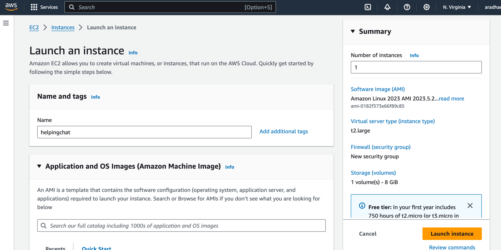
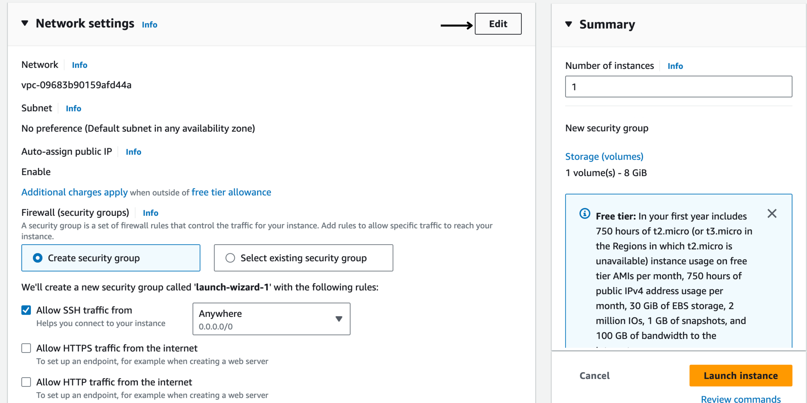
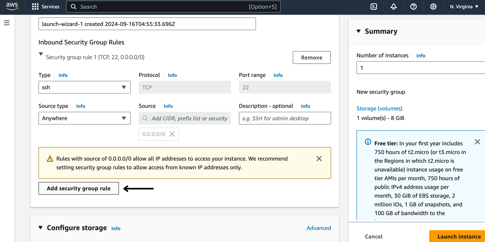
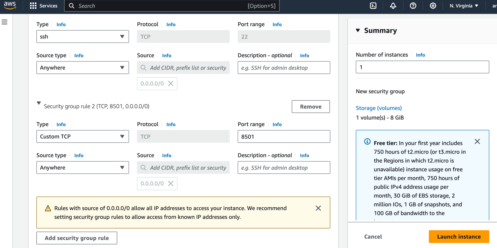
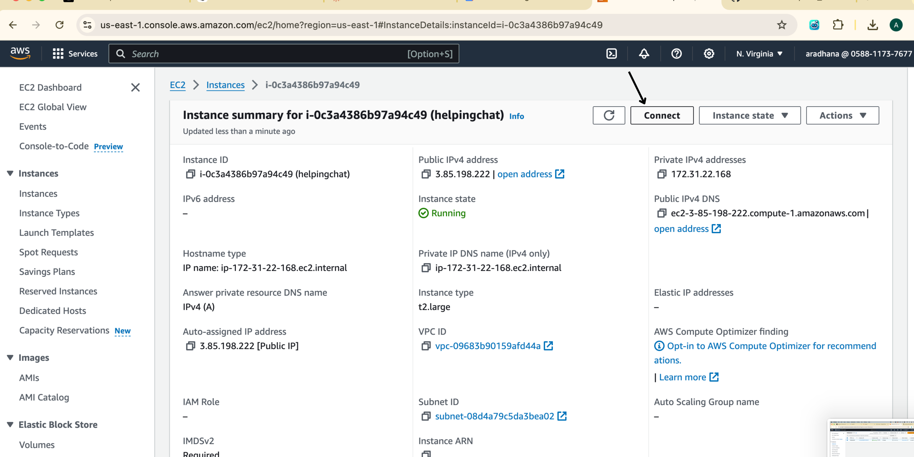
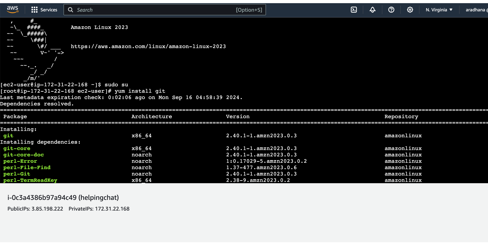
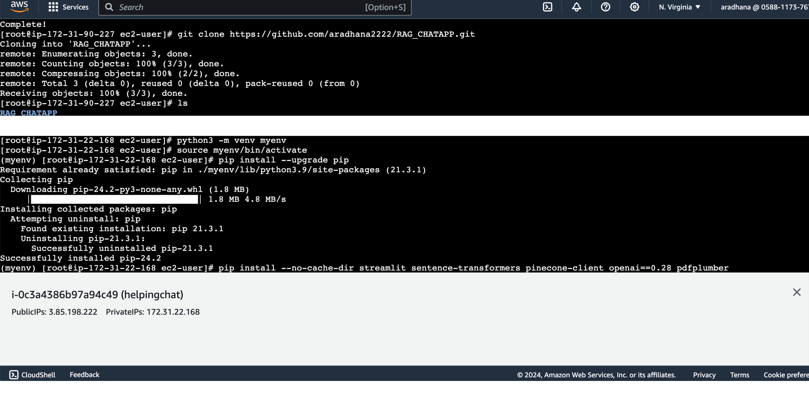
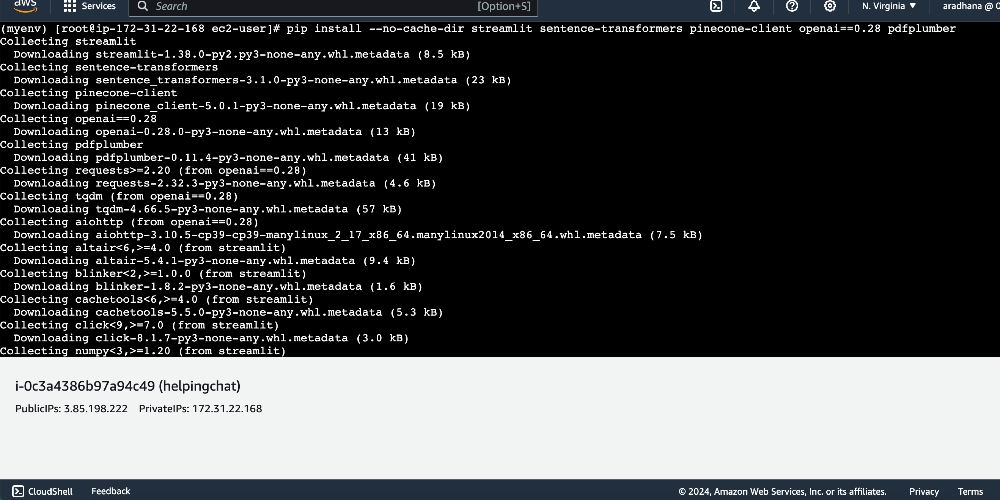
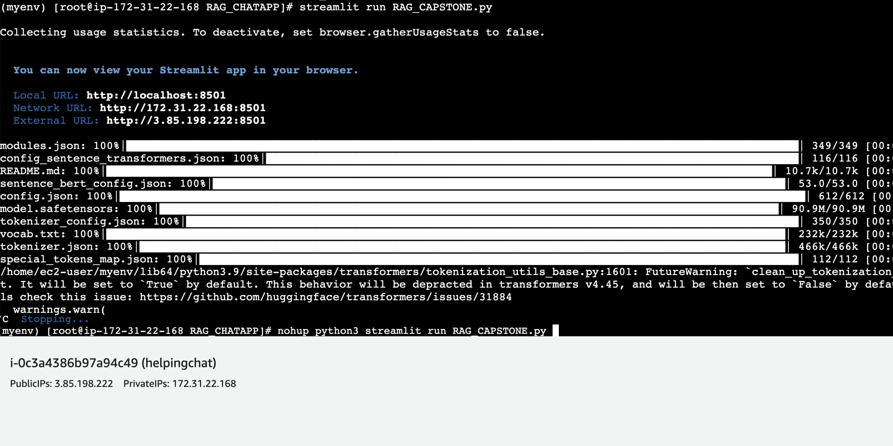

# AWS Deployment Guide

This guide walks you through the process of deploying your application on an AWS EC2 instance.

## 1. Launch EC2 Instance

1. Go to the Amazon AWS console and search for "EC2".
2. Click on "Launch Instance".
3. Provide a name for your instance.



4. Select the instance type that suits your needs.


## 2. Configure Network Settings

1. Click on "Edit" in the Network Settings section.



2. Click on "Add security group rule".



3. Add port range 8501 and set the source type to "Anywhere".
4. Click on "Launch Instance".



## 3. Connect to Your Instance

1. Once the instance is launched, click on the instance ID.


2. Click on "Connect".



## 4. Set Up the Environment

1. In the CLI, change to superuser:
   ```
   sudo su
   ```

2. Install git:
   ```
   yum install git
   ```



3. Install Python3-pip:
   ```
   yum install python3-pip
   ```


4. Clone your repository:
   ```
   git clone <your_repo_link>
   ```

5. Create a Python virtual environment:
   ```
   python3 -m venv myenv
   ```



6. Install necessary libraries:
   ```
   pip install --no-cache-dir streamlit sentence-transformers pinecone-client openai==0.28 pdfplumber
   ```



## 5. Configure and Run Your Application

1. Change directory to your repo:
   ```
   cd <directory_name>
   ```

2. Edit your Python file to add your API key:
   ```
   nano <Your_pythonfile.py>
   ```


3. Run your script:
   ```
   streamlit run <Your_pythonfile.py>
   ```

4. For continuous running of the instance even after closing the tab:
   ```
   nohup python3 -m streamlit run <Your_pythonfile.py> &
   ```



Congratulations! Your application should now be deployed and running on AWS EC2.